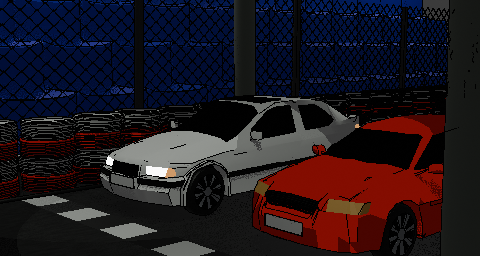

# KajakRacing

KajakRacing is an exciting 2D racing game with arcade-style mechanics, dynamic weather effects, power-ups, and customizable vehicles. Race against AI opponents on various tracks while using nitro boosts and avoiding banana peels!



📙 [live preview](https://kajakracing-kajaksolutions.granacik.pl)

## Documentation
📙 [here](https://docs-kajaksolutions.granacik.pl)

## Devlog
 🧊 [here](https://kajaksolutions.granacik.pl)

## 💪 Engine
More about KajakEngine here:

🗃️ [repository](https://github.com/KajakSolutions/KajakEngine)

📦 [package](https://www.npmjs.com/package/@kajaksolutions/kajakengine)


## 🎮 Features

- **Arcade Racing Mechanics**: Easy to learn, hard to master physics-based driving system
- **Vehicle Customization**: Purchase and upgrade vehicles with different handling characteristics
- **Power-ups**: Collect nitro boosts and banana peels to gain advantage or sabotage opponents
- **Dynamic Weather System**: Race in changing weather conditions that affect vehicle handling
- **Multiple Tracks**: Challenge yourself on various difficulty tracks
- **AI Opponents**: Compete against AI drivers with different personalities and driving styles
- **In-game Economy**: Earn money by winning races to buy new cars and upgrades

## 🚗 Vehicles

Each vehicle has unique stats and characteristics:
- **Speed**: Affects top speed and acceleration
- **Nitro**: Determines nitro efficiency and boost duration
- **Drive**: Choose between FWD, RWD, and 4WD that affect handling

## 🛠️ Technical Details

KajakRacing is built with:
- **React**: Frontend UI components
- **TypeScript**: Type-safe JavaScript for game logic
- **Custom Physics Engine**: Built from scratch for arcade-style racing
- **Collision Detection**: Accurate collision system based on polygon and AABB colliders
- **Canvas Rendering**: Efficient 2D rendering using HTML5 Canvas
- **Sound System**: Dynamic sound effects and music with volume controls

## 🎛️ Controls

- **Arrow Up**: Accelerate
- **Arrow Down**: Brake/Reverse
- **Arrow Left/Right**: Steer left/right
- **Space**: Activate nitro boost
- **B**: Drop banana peel
- **F12** or **`**: Open developer console
- **Escape**: Pause game

## 🖥️ Developer Console Commands

Access the in-game developer console by pressing **F12** or **`** during gameplay. Available commands:

- **help**: Display a list of all available commands
- **debug**: Toggle debug visualization mode
- **tp [x] [y]**: Teleport player car to specific coordinates
- **nitro [amount]**: Set the player's nitro amount
- **weather [clear|rain|snow]**: Force a specific weather condition
- **banana [amount]**: Give player the specified number of banana peels
- **spawn banana**: Create a banana peel at a position near the player
- **exit**: Close the console

## 🚀 Getting Started

### Prerequisites

- Node.js 18.x or later
- npm or yarn

### Installation

1. Clone the repository
   ```
   git clone https://github.com/KajakSolutions/kajakracing.git
   cd kajakracing
   ```

2. Install dependencies
   ```
   npm install
   ```

3. Start the development server
   ```
   npm run dev
   ```

4. Open your browser and navigate to `http://localhost:5173`

### Building for production

```
npm run build
```

## 🧩 Project Structure

```
kajakracing/
├── public/              # Static assets (images, sounds)
├── src/
│   ├── components/      # React components for UI
│   ├── context/         # Game context and state management
│   ├── engine/          # Core game engine class
│   └── utils/           # Helper functions
└── index.html           # Entry HTML file
```

## 🎵 Audio Credits

The music used in this game was created by our team.


##  🚗 Graphics info

The graphics in the game are made 100% by us: [DRIVE](https://drive.google.com/drive/folders/1V4paLGi2KZURRBb02bdCe9xelKU6he4F?usp=sharing)

## 🤝 Contributing

Contributions are welcome! Please feel free to submit a Pull Request.

1. Fork the repository
2. Create your feature branch (`git checkout -b feature/amazing-feature`)
3. Commit your changes (`git commit -m 'Add some amazing feature'`)
4. Push to the branch (`git push origin feature/amazing-feature`)
5. Open a Pull Request

## 📝 License

This project is licensed under the MIT License - see the [LICENSE](LICENSE) file for details.


